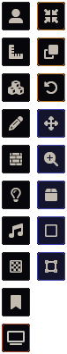
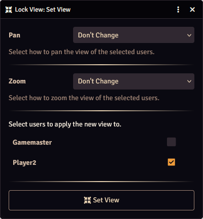

The Lock View control buttons (the buttons on the left of the display) allow quick access to some of the most important features of the module.
The control buttons are displayed and useable for anyone for whom Control is enabled in the [User Configurator](./moduleSettings/userConfig.md).

You can access the Lock View control buttons by pressing the Lock View (:fontawesome-solid-tv:) category, where you will find the following controls:

| Icon | Name | Function |
|------|------|----------|
| :fontawesome-solid-minimize: | Set View | Opens the [Set View dialog](#set-view-dialog) to set the view of users |
| :fontawesome-solid-clone: | Clone View | [Clones](./cloneView.md) your view to users |
| :fontawesome-solid-arrows-up-down-left-right: | Pan Lock | Toggles [Pan Lock](./sceneConfig/locks.md) on or off |
| :fontawesome-solid-magnifying-glass-plus: | Zoom Lock | Toggles [Zoom Lock](./sceneConfig/locks.md) on or off |
| :fontawesome-solid-box: | Bounding Box | Toggles [Bounding Box](./sceneConfig/locks.md) on or off |
| :fontawesome-solid-square: | Viewbox | Toggles [viewbox](./viewbox.md) display on or off |
| :fontawesome-solid-vector-square: | Edit Viewbox | Toggles [viewbox editing](./viewbox.md#edit-viewbox) on or off |

??? info "Hiding the Control Buttons"
    If you do not want to use the control buttons you can hide them with the "Hide Control Button" setting in the Lock View [module settings](./moduleSettings/moduleSettings.md).

## Set View Dialog

The Set View control button opens the Set View dialog, which allows you to set the view of selected users.

### Pan
The Pan setting determines how the user's view is panned (moved horizontally and vertically).

| Option | Effect |
|--------|--------|
| Don't Change | View is not panned |
| Set to Initial View | Pan the view to the initial view position |
| Horizontal Fit | [Horizontally fit](./sceneConfig/autoscaling.md#horizontal-fit) the view to the scene |
| Vertical Fit | [Vertically fit](./sceneConfig/autoscaling.md#vertical-fit) the view to the scene |
| Automatic Fit (Inside) | [Automatically fit](./sceneConfig/autoscaling.md#automatic-fit-inside) the view to the scene, keeping the view inside of the scene |
| Automatic Fit (Outside) | [Automatically fit](./sceneConfig/autoscaling.md#automatic-fit-outside) the view to the scene, allowing some of the view outside of the scene |
| Move Grid Spaces | Move the view by a specified amount of grid spaces |
| Move by Coordinates | Move the view by specified coordinates (added to the current coordinates) |
| Move to Coordinates | Move the view to specified coordinates |
| Clone View | Set the view position to your current view position |

### Zoom
The zoom setting determines how the user's view is zoomed in or out.

| Option | Effect |
|--------|--------|
| Don't Change | Zoom/scale is not changed |
| Set to Initial View | Zoom the view to the initial view position |
| Set Scale | Set the zoom level/scale to a specified value |
| Set to Physical Grid Size | Zoom to set the grid size to a [physical value](./sceneConfig/autoscaling.md#physical-grid-size) |
| Clone View | Set the zoom level to your current zoom level |

### Users
A list of all users is displayed, select which users to apply the new view to. 
Users for whom Enable is selected in the [User Configurator](./moduleSettings/userConfig.md) will be selected automatically.

The view of the selected users will change, regardless of any [locks](./sceneConfig/locks.md) that are in place or how the users are configured in the User Configurator, as long as the users are on the same scene.

### Setting the View & Other Settings

* If [Bounding Box](./sceneConfig/locks.md) is enabled, as soon as the users tries to zoom or pan or they resize the browser window, the view will be set so it is within the bounding box
* If any [autoscaling](./sceneConfig/autoscaling.md) is enabled in the scene config and both Zoom and Pan locks are enabled, as soon as the users tries to zoom or pan or they resize the browser window, the autoscaling will take over