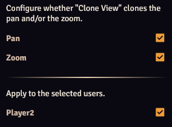

The Clone View Configurator configures what happens when the view is cloned (when your view is applied to users) when the [Clone View control button](../controlButtons.md) or the Clone View hotkey is pressed. 
It is accessible from the [module settings](./moduleSettings.md) or by right-clicking the Clone View [control button](../controlButtons.md).

??? info "Setting the Clone View Hotkey"
    The Clone View hotkey is set to Alt + C by default, but this can be configured in the [Controls Configuration](./hotkeys.md).