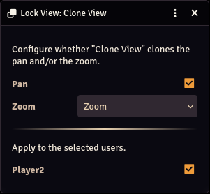

The Clone View Configurator configures what happens when the view is cloned (when your view is applied to users) when the [Clone View control button](../controlButtons.md) or the Clone View hotkey is pressed. 
It is accessible from the [module settings](./moduleSettings.md) or by right-clicking the Clone View [control button](../controlButtons.md).

??? info "Setting the Clone View Hotkey"
    The Clone View hotkey is set to Alt + C by default, but this can be configured in the [Controls Configuration](./hotkeys.md).

## Pan
If enabled, will pan the selected users to the current view.

## Zoom
If enabled, will zoom the selected users to the current zoom. Due to differing display aspect resolutions and/or aspect ratios the zoom level a user might experience might be different from yours. 

Zoom has the following options:

* <b>Disabled</b>: Do not zoom.
* <b>Zoom</b>: Use the current zoom/scale level, the amount it zooms is dependent of a user's display resolution (for 2 users with different resolutions it will zoom differently).
* <b>Horizontal View</b>: Clone the view so your current view will be cloned such that your horizontal view will be identical to the user's horizontal view.
* <b>Vertical View</b>: Clone the view so your current view will be cloned such that your vertical view will be identical to the user's vertical view.
* <b>Automatic (Inner)</b>: Similar to "Horizontal View" or "Vertical View", but Lock View will select between them so that the user's view fits inside your view.
* <b>Automatic (Outer)</b>: Similar to "Automatic (Inner)", but the opposite situation.

## Users
By default, the cloning will be applied to all users with [Enable](./userConfigurator.md) enabled. 
You can choose to apply it to a selection of users.