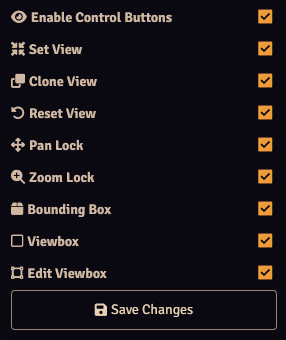

Control users will have access to the Lock View [control buttons](../controlButtons.md). In this menu you can enable or disable all or some of the control buttons. 
It is accessible from the [module settings](./moduleSettings.md).

If Enable Control Buttons is unchecked, none of the control buttons (including the Lock View category) will show up. 
All other options correspond to one of the buttons.