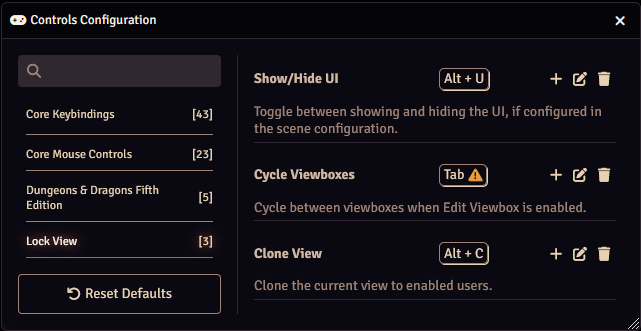

There are multiple Lock View hotkeys available. These can be found and edited by pressing the Configure Controls button in the Game Settings sidebar tab.

| Name              | Default   | Function  |
|-------------------|-----------|-----------|
| Show/Hide UI      | Alt + U   | Toggles between showing and hiding the UI elements that are configured in the [Scene Configuration](../sceneConfig/sceneConfig.md). |
| Cycle Viewboxes   | Tab       | When multiple [viewboxes](../viewbox.md) are displayed and Edit Viewbox is enabled, this hotkey will cycle between the viewboxes to set which one is being edited. |
| Clone View        | Alt + C   | Clones the current view to enabled users. Configured in the [Clone View Configurator](./cloneViewConfigurator.md). |