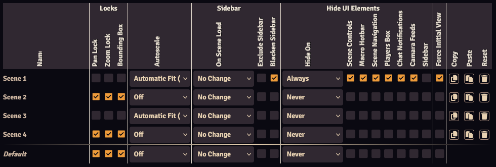

 
The Scene Configurator gives an overview of all scenes in your world, and allows you to set each Lock View setting. 
It is accessible from the [module settings](./moduleSettings.md) or from each scene's [configuration](../sceneConfig/sceneConfig.md). 

Each row corresponds to a scene. The setting and their functions are identical to the [Scene Config](../sceneConfig/sceneConfig.md) (accessible by right-clicking a scene and selecting configure). All settings are applied immediately.

Each row has 3 buttons:

* <b>Copy</b>: Copy the selected scene's settings.
* <b>Pase</b>: Paste the copied scene's settings onto the selected scene.
* <b>Reset</b>: Reset the selected scene's settings to the default settings.

The Default row are applied to all new and unconfigured scenes, and to scenes that are reset with the Reset button.