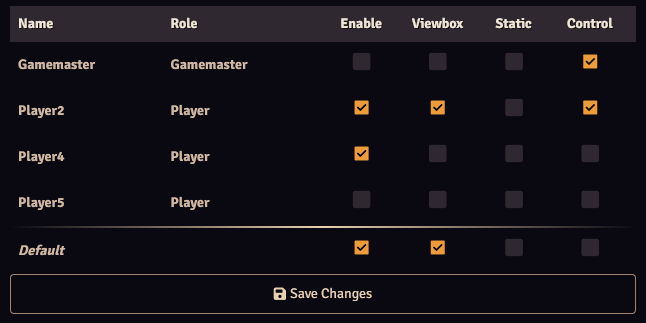

The user configurator is used to configure what functions are available/applicable to each user. 
It is accessible from the [module settings](./moduleSettings.md).

Each row in the column corresponds to a user, where the Enable, Viewbox, Static and Control checkboxes enable or disable the following:

* <b>Enable</b>: Enables all of Lock View's functions, except for the functions covered by Viewbox and Static.
* <b>Viewbox</b>: Users with this setting enabled will share their view with Control users, Control users can display this view using the control buttons and change it, which allows them to control the view of other users. More info on the viewbox can be found [here](../viewbox.md).
* <b>Static</b>: Static users will not change scenes when, for example, a scene is activated. Control users can change scenes for Static users by right-clicking a scene in the scene navigation and selecting Pull Static Users.
* <b>Control</b>: Users with this setting enabled can control Lock View's functions. This includes setting (pan or zoom) locks and changing a user's view using the viewbox.

The Default row is applied to new and unconfigured non-gamemaster users. Gamemasters default to everything off except for Control.