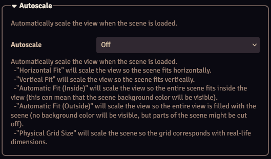

Autoscaling can automatically scale the view using one of several modes.

??? info "Autoscaling and Locks"
    If no [locks](./locks.md) are configured, the autoscaling is only applied after the scene is loaded. This means that users can zoom and pan, and if they change the browser's window size the autoscaling might not be correct anymore.
    If both Zoom and Pan locks are enabled, the configured autoscaling will always be enforced.

## Modes
### Horizontal Fit
Automatically scales the scene to fit the browser window horizontally. This might result in padding being visible if the scene height is too small, or this might cut off parts at the top or bottom of the scene if the scene is too heigh.

### Vertical Fit
Automatically scales the scene to fit the browser window vertically. This might result in padding being visible if the scene is too narrow, or this might cut off parts at the left or right of the scene if the scene is too wide.

### Automatic Fit (Inside)
Automatically chooses between horizontal or vertical fit, depending on the aspect ratio of the display and the scene. The view will stay inside the scene, so no padding will be visible. This might cut off parts of the scene.

### Automatic Fit (Outside)
Automatically chooses between horizontal or vertical fit, depending on the aspect ratio of the display and the scene. The view will display the entire scene, but padding might be visible.

### Physical Grid Size
Scales the scene so the on-screen gridsize corresponds with a real world value (for example 25mm or 1"). The gridsize is determined by the Physical Grid Size settings in the [module settings](../moduleSettings/moduleSettings.md). 