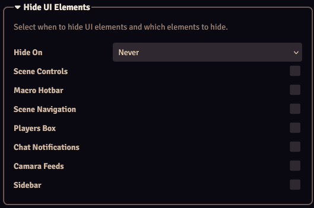

With the Hide UI Elements settings you can configure specific Foundry elements to be hidden.

| Setting           | Description                       |
|-------------------|-----------------------------------|
| Hide On   | Configures when to hide the selected elements: <b>-Never</b>: Never hide the UI elements. <b>-Always</b>: Always hide the UI elements. <b>-Scene Load</b>: Hide the UI elements when the scene is loaded. <b>-Sidebar Collapse</b>: Hide the UI elements if the sidebar is collapsed.         |
| Scene Controls    | Hide the scene control buttons.   |
| Macro Hotbar      | Hide the macro hotbar.            |
| Scene Navigation  | Hide the scene navigation.        |
| Players Box       | Hide the players box.             |
| Camera Feeds      | Hide the camera feeds.            |
| Sidebar           | Hide the sidebar.                 |

Hiding and showing the UI elements can be toggled with a configurable hotkey. By default this is `Alt + U`.