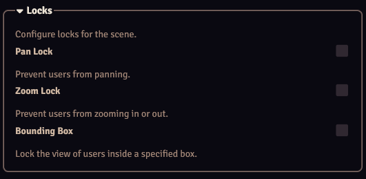

The Lock View locks allow you to limit the panning and/or zooming behavior of Enable players (as configured in the [User Configurator](../moduleSettings/userConfigurator.md)).

There are 3 different lock types, which can be enabled or disabled independently:

| Lock Type                     | Description                                                           |
|-------------------------------|-----------------------------------------------------------------------|
| Pan Lock                      | Prevent users from panning.                                           |
| Zoom Lock                     | Prevent users from zooming in or out.                                 |
| [Bounding Box](#bounding-box) | Limit the zooming and panning of users to a specific bounding box.    |

These locks can be configured in a scene's [Scene Config](./sceneConfig.md), the [Scene Configurator](../moduleSettings/sceneConfigurator.md), or through the Lock View [control buttons](../controlButtons.md). Changes are persistent (they do not reset).

## Bounding Box
The Bounding Box lock can be used to limit the panning and zooming of users to ensure their view stays within a specific area.

If no bounding box is configured, the bounding box will default to the scene dimensions (so players will not be able to see any padding).

A bounding box is specified by drawing a rectangle the size of the desired bounding box. In the drawing configuration, a Lock View tab can be found, where you can configure the bounding box rules for that rectangle:

| Mode  | Description   |
|----|---|
| Disabled | Rectangle is not used as bounding box. |
| Owned Tokens | View is forced to this bounding box if the player owns a token within this bounding box, otherwise the scene dimensions will be the bounding box. |
| Always    | View is always forced to this bounding box. |

### Multiple Bounding Boxes
It is possible to have multiple bounding boxes on a single scene. The following priority is used:

1. There are multiple "Owned Tokens" bounding boxes with player owned tokens: The view is bound so all of these bounding boxes can be viewed.
2. There is a single "Owned Tokens" bounding box with player owned tokens: The view is bound to this bounding box.
3. There are multiple "Always" bounding boxes: The view is bound so all of these bounding boxes can be viewed.
4. There is a single "Always" bounding box: The view is bound to this bounding box.
5. The view is bound to the scene dimensions.