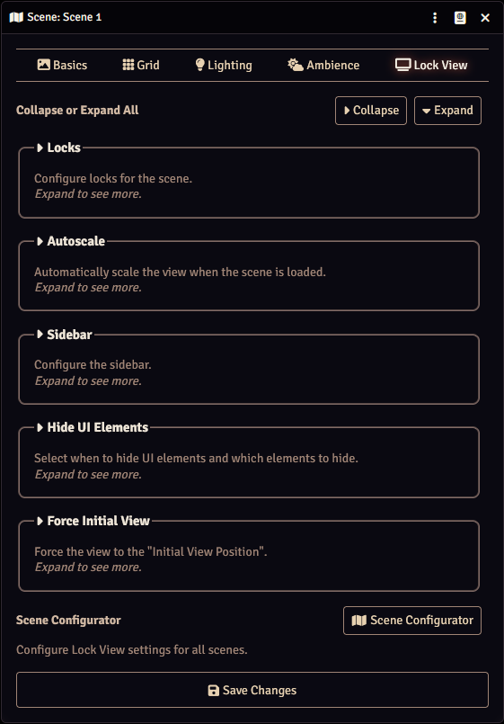

A new Lock View tab has been added to the scene configuration. Here you can configure what Lock View does on the scene.

The various settings are divided into sections:

* <b>[Locks](./locks.md)</b>: Configure locks for the scene.
* <b>[Autoscale](./autoscale.md)</b>: Automatically scale the view when the scene is loaded.
* <b>[Sidebar](./sidebar.md)</b>: Configure the sidebar.
* <b>[Hide UI Elements](./hideElements.md)</b>: Select when to hide UI elements and which elements to hide.
* <b>[Force Initial View](./initialView.md)</b>: Force the view to the Initial View Position.

Each section can be expanded and collpased by pressing the section label, or you can expand or collapse them all by pressing the buttons at the top.

The Scene Configurator button at the bottom will open the [Scene Configurator](../moduleSettings/sceneConfigurator.md) where you can configure the scene settings for all scenes, and the default settings that are applied to new scenes.

??? info "On Changes"
    Any changes that are made are applied when the Save Changes button is pressed. This will apply all scene settings to Enable users. This means that the locks are applied, the scene is autoscaled (if set), the view is set the the Initial View Position (if configured), etc.