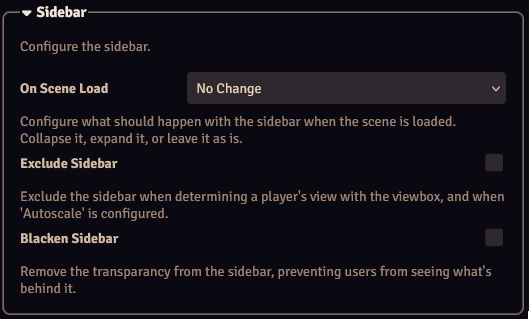

The sidebar options allow you to configure how the Foundry sidebar behaves.

| Setting   | Description   |
|--|--|
| On Scene Load | Configures what should happen with the sidebar when a scene is loaded: <b>-No Change</b>: Do not change the sidebar. <b>-Collapse</b>: Collapse the sidebar. <b>-Expand</b>: Expand the sidebar. |
| Exclude Sidebar   | Exclude the width of the sidebar when determining a player's view when a [viewbox](../viewbox.md) is displayed, and when [Autoscale](./autoscale.md) is configured.   |
| Blacken Sidebar   | Removes the transparancy from the sidebar, preventing users from seeing what's behind it. |