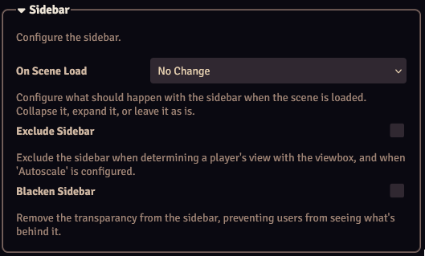

The "Sidebar" and "Audio/Video Dock" options allow you to configure how the Foundry sidebar/AV dock behaves.

| Setting   | Description   |
|--|--|
| On Scene Load | Configures what should happen when a scene is loaded: <b>-No Change</b>: Do not change the sidebar/dock. <b>-Collapse</b>: Collapse the sidebar/dock. <b>-Expand</b>: Expand the sidebar/dock. |
| Exclude Sidebar/Dock   | Exclude the width of the sidebar/dock when determining a player's view when a [viewbox](../viewbox.md) is displayed, and when [Autoscale](./autoscale.md) is configured.   |
| Blacken Sidebar/Dock   | Removes the transparancy from the sidebar/dock, preventing users from seeing what's behind it. |