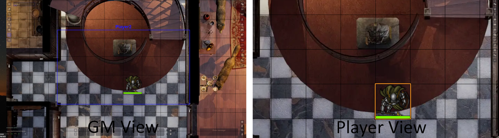
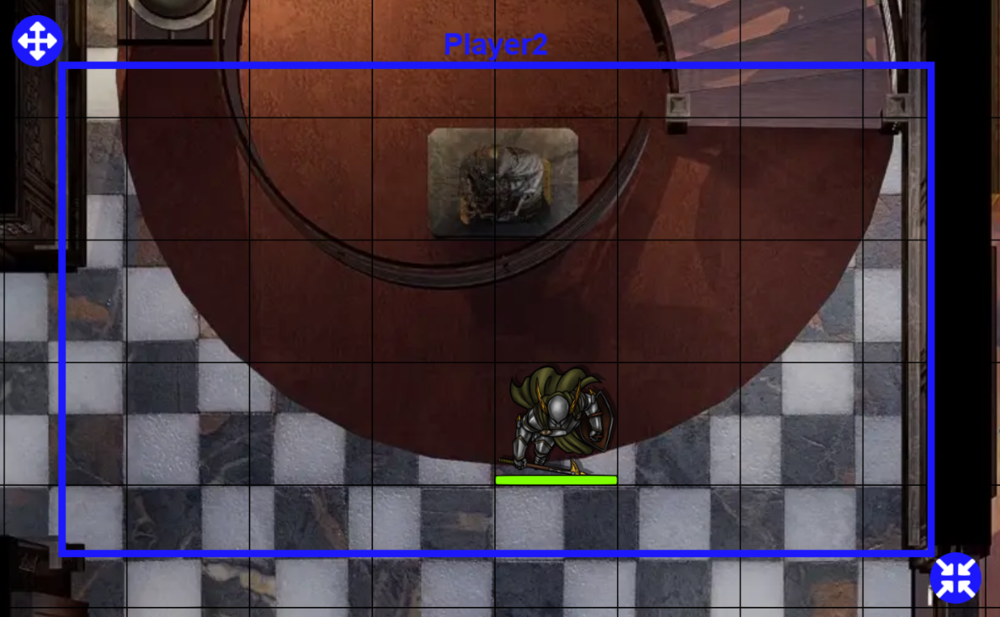

# Viewbox

The viewbox is a feature of Lock View that shows Control users what selected players are currently seeing, and allows Control users to [edit](#edit-viewbox) the view of those users. This feature is especially useful for in-person setups, because with those setups you might not want to use a mouse to move around. Using the viewbox, the gamemaster (or other user) can do that.

Users with Viewbox enabled in the [User Configurator](./moduleSettings/userConfigurator.md) will share their view with users with Control enabled in that same configurator. These Control users can show or hide the viewbox using the Lock View [control buttons](./controlButtons.md).

Each viewbox will show the name of the corresponding user, and its color corresponds with the player color (configured in Foundry's User Configuration which can be accessed by right-clicking the user in the user section at the bottom left of the screen).

??? info "Excluding the Sidebar"
    By default, the entire view of a user is displayed. However, when the sidebar of a user is open, part of the scene will be obscured by the sidebar. To account for this, you can enable Exclude Sidebar in the [Scene Configuration](./sceneConfig/sceneConfig.md).

## Edit Viewbox

By enabling the Edit Viewbox [control button](./controlButtons.md), a Control user can edit the view of a player by editing its viewbox.

You can edit the viewbox (and thus set a user's view) in 2 ways:

1. Dragging the two buttons on the top-left and bottom-right corners of the viewbox: 
    :fontawesome-solid-arrows-up-down-left-right: Move the viewbox to move the user's view. 
    :fontawesome-solid-arrows-to-dot: Resize the viewbox to zoom the user's view in or out.
2. Using the mouse: 
    Right-Mouse Drag: Move the viewbox to move the user's view. 
    Mousewheel: Resize the viewbox to zoom the user's view in or out.

Viewbox editing will automatically be disabled when:

* The viewbox control button is disabled.
* Another (non-Lock View) control is selected.

??? info "Multiple Viewboxes"
    When multiple viewboxes are displayed, you can select which one to edit using the tab key. The active, editable, viewbox will have a thicker line. 
    The hotkey (tab by default) can be [changed](./moduleSettings/hotkeys.md).
    
??? info "Disabling Mouse Viewbox Editing"
    When changing the viewbox, the mousewheel and right-mouse drag will no longer change your view, instead it will be used to change the view of the user's view. You can disable this in the [module settings](./moduleSettings/moduleSettings.md).